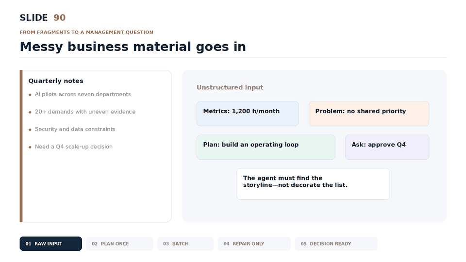
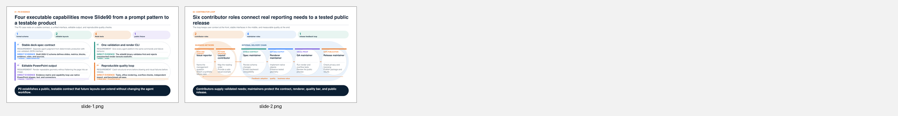
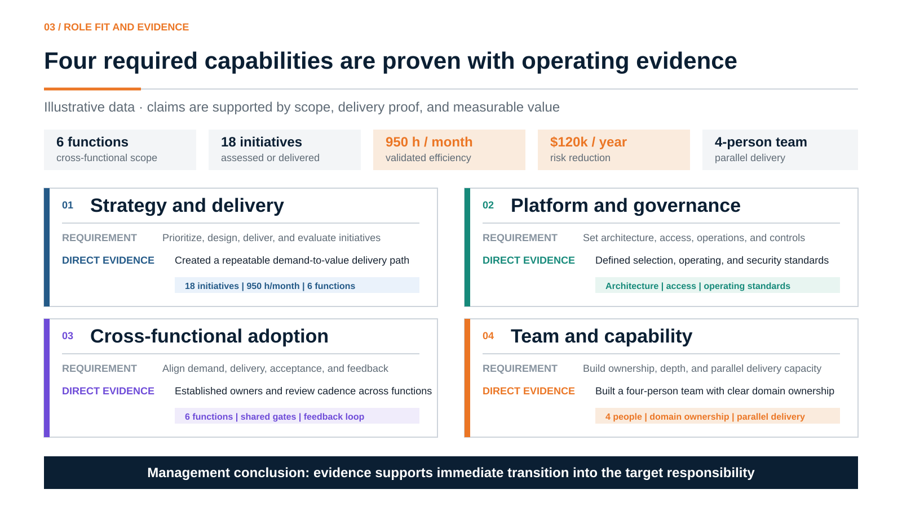
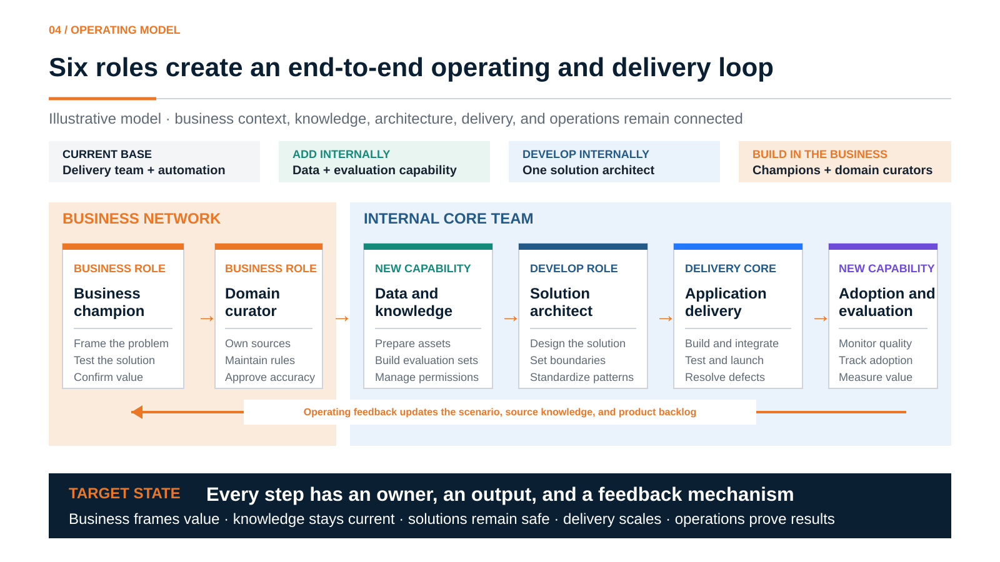

# Slide90

**A usable 80-point deck in minutes—not an autonomous attempt at 100.**

Slide90 is an open-source Agent Skill that preserves a user's reporting structure and turns business material into a fast, stable, editable executive draft. It removes layout work, supports whole-deck and single-slide generation, locks passing pages, and leaves final polish to targeted edits.

**P1 is executable:** the renderer now supports six high-frequency management layouts, a lightweight brief contract, whole-deck generation, single-slide output, and targeted page replacement.

In the checked-in controlled five-slide benchmark, the Fast Loop reduced renderer wall time by **58%**. The name is the ambition; the benchmark is the evidence.

[中文说明](README.zh-CN.md) · [Benchmark](BENCHMARK.md) · [Roadmap](ROADMAP.md) · [Contributing](CONTRIBUTING.md)



## P1: preserve the story, remove the formatting work




Run the six-slide synthetic Chinese acceptance fixture:

```bash
npm ci
node bin/slide90.mjs validate examples/p1/deck-spec.zh-CN.json
node bin/slide90.mjs render examples/p1/deck-spec.zh-CN.json --output deck.pptx
node bin/slide90.mjs render-slide examples/p1/deck-spec.zh-CN.json --slide 3 --output slide-3.pptx
node bin/slide90.mjs replace-slide examples/p1/deck-spec.zh-CN.json --slide 5 \
  --with examples/p1/replacement-slide-5.zh-CN.json --output updated.pptx
```

Run the P1 delivery gate:

```bash
npm run verify:p1
```

The checked P1 gate currently completes in about **1.3 seconds**. It validates the six-layout fixture, renders the full deck three times, verifies semantic stability, checks editable shapes and Chinese font declarations, renders one page independently, replaces slide 5, and proves that the other five slide XML files remain unchanged. It fails above 600 seconds. See [`benchmarks/results/p1-verification-latest.json`](benchmarks/results/p1-verification-latest.json) for the exact latest run. Model inference, queueing, network transfer, and human approval are outside this renderer measurement.

The project now proves a stable production path; it does **not yet claim** that every real-world deck reaches the 80-point usability bar. A ten-deck human-scored Chinese benchmark is the next evidence milestone.

The core suite at [`evals/cases.json`](evals/cases.json) contains three synthetic prompts for each of the eight management layouts. Every case defines its expected layout, title intent, required facts, and facts that must not be invented.

Run `npm run eval:baseline` to answer all 24 prompts with a rule-based planner that cannot read the answer-key fields, then score layout routing, factual retention, forbidden-claim hits, action-title quality, content structure, and full-prompt copying. External agents must read only `evals/blind-prompts.json`, whose opaque IDs do not reveal layouts and whose instructions require English output with original numbers, dates, and proper nouns preserved. This is a harness smoke test, not a claim about final AI design quality.

The contract is published at [`schema/deck-spec.schema.json`](schema/deck-spec.schema.json). The fixture preserves the full path from [synthetic source notes](examples/end-to-end/source.md) to [deck specification](examples/end-to-end/deck-spec.json), [editable PPTX](examples/end-to-end/output/slide90-p0-demo.pptx), and PNG preview.

## What it produces

| Evidence matrix | Operating model |
|---|---|
|  |  |

The examples use synthetic data and contain no proprietary company information.

## Why Slide90

- **Decision first** — action titles answer the management question instead of naming a topic.
- **Evidence over adjectives** — claims are tied to metrics, delivery proof, mechanisms, or ownership.
- **Preserve the user's story** — existing reporting structures stay intact; missing structures receive only lightweight guidance.
- **Plan once, render once** — one deck specification replaces repeated slide-by-slide reasoning.
- **Whole deck or one page** — batch-generate the draft or replace one page without changing the others.
- **Targeted repair** — passing slides stay locked; only failed elements are regenerated.
- **Tested layouts** — eight executive layouts use fixed content zones and machine-readable design tokens.
- **No AI-slop styling** — strict grid, white canvas, restrained accents, readable type, and no decorative clutter.
- **Cross-platform** — designed for ChatGPT/Codex, Claude Code, Cursor, Gemini CLI, WorkBuddy, and other Agent Skills-compatible runtimes.

## Fast Loop


The workflow separates judgment from production. The agent decides the storyline and layout once; deterministic coordinates and validators handle repeated execution.

## Install

```bash
git clone https://github.com/ruidaruan-dev/slide90.git
cd slide90

python scripts/install.py --target codex
# also: claude, cursor, gemini, workbuddy
```

Preview without writing:

```bash
python scripts/install.py --target workbuddy --dry-run
```

Install to a custom location:

```bash
python scripts/install.py --dest /path/to/skills/build-executive-report-slides
```

## Use

```text
Use $build-executive-report-slides in Fast Loop mode to turn these quarterly
project notes into a five-slide executive update. Preserve every number,
use conclusion-led titles, render the deck once, and repair only failed slides.
```

```text
Use $build-executive-report-slides to redesign this role-fit page as an
evidence matrix. Do not invent evidence. Return an editable 16:9 slide.
```

## Eight management layouts

Six layouts currently have deterministic editable renderers. `diagnosis-tree` and `comparison-matrix` remain routing specifications until their renderers land.

| Management question | Layout ID |
|---|---|
| What has been achieved? | `performance-dashboard` |
| Why should leadership believe it? | `evidence-matrix` |
| What is wrong and why? | `diagnosis-tree` |
| What will we do and when? | `roadmap` |
| How will the organization operate? | `capability-loop` |
| Which projects get resources? | `portfolio-table` |
| Which option should we choose? | `comparison-matrix` |
| What must leadership decide? | `decision-page` |

## Repository structure

```text
slide90/
├── SKILL.md                    # Agent workflow and hard rules
├── bin/slide90.mjs             # validate/render CLI
├── schema/deck-spec.schema.json # stable planner-renderer contract
├── src/render/                 # editable PPTX renderer
├── assets/layout-specs.json    # Stable layout coordinates
├── assets/design-tokens.json   # Visual system
├── references/fast-loop.md     # Batch and targeted-repair protocol
├── examples/                   # Synthetic visual examples
├── benchmarks/                 # Reproducible five-slide runner
├── evals/                      # Layout-routing quality cases
├── scripts/                    # Installer, validators, packager
└── .github/workflows/          # Automated validation and releases
```

## Validate and package

```bash
node bin/slide90.mjs validate examples/end-to-end/deck-spec.json
npm test
npm run eval:validate
npm run eval:baseline
npm run verify:p0
npm run verify:p1
npm run benchmark
python scripts/validate_repo.py
python -m unittest discover -s tests
python scripts/package_skill.py
```

The portable skill archive is written to `dist/slide90.skill.zip`.

## Privacy

Never commit real internal decks, watermarked screenshots, customer names, confidential metrics, or company templates without written permission. Use synthetic or explicitly cleared examples only.

## License

Apache License 2.0. See [LICENSE](LICENSE).
